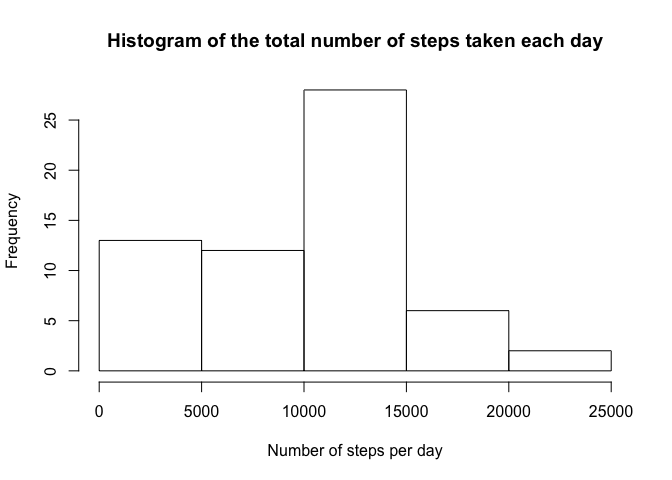
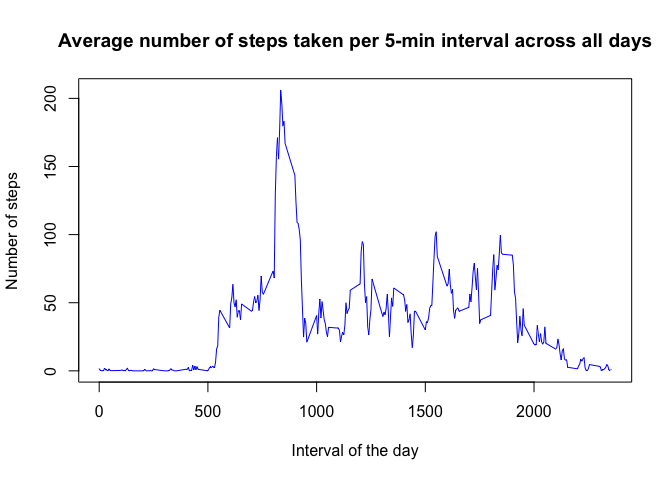
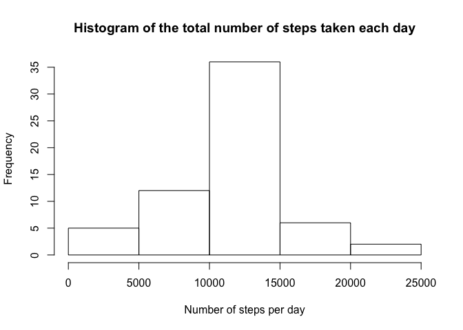
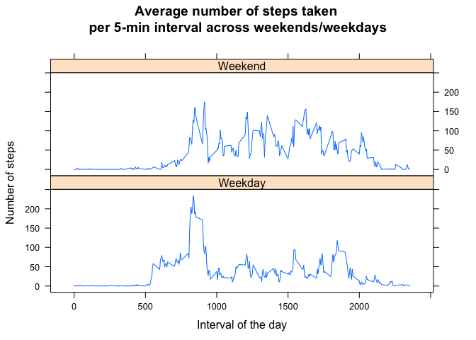

#Reproducible Research: Peer Assessment 1
#### Author: Diqing Fei

###1. Loading and preprocessing the data

```r
filename <- "activity.csv"

if (!file.exists("filename")) {
  fileurl <- "https://d396qusza40orc.cloudfront.net/repdata%2Fdata%2Factivity.zip"
  download.file(fileurl, "activity.zip", method="curl")
  unzip("activity.zip")
}

activity <- read.csv(filename)
activity$date <- as.Date(activity$date)
```

###2. What is mean total number of steps taken per day?


```r
step_per_day <- tapply(activity$steps,activity$date,sum, na.rm=TRUE)
hist(step_per_day, xlab="Number of steps per day", main="Histogram of the total number of steps taken each day")
```

<!-- -->

```r
mean(step_per_day)
```

```
## [1] 9354.23
```

```r
median(step_per_day)
```

```
## [1] 10395
```

The mean number of steps taken per day is 9354.2295082.
The median number of steps taken per day is 10395.


###3. What is the average daily activity pattern?


```r
avgstep <- aggregate(steps ~ interval, activity, mean, na.rm=TRUE)
plot(avgstep, type="l", col="blue", xlab="Interval of the day", ylab="Number of steps", 
     main="Average number of steps taken per 5-min interval across all days")
```

<!-- -->

```r
avgstep[which.max(avgstep$steps),]
```

```
##     interval    steps
## 104      835 206.1698
```

The 5-min interval 835 on average across all the days in the dataset, contains the maximum number of steps 206.1698113.

###4. Imputing missing values


```r
sum(is.na(activity))
```

```
## [1] 2304
```

```r
sum(is.na(activity$steps))
```

```
## [1] 2304
```

```r
sum(is.na(activity$date))
```

```
## [1] 0
```

```r
sum(is.na(activity$interval))
```

```
## [1] 0
```

We can see the NA only appears in "steps" column.


```r
activity[is.na(activity),]$steps <- mean(activity$steps, na.rm=TRUE)

#Create a new dataset that is equal to the original dataset but with the missing data filled in.

activityna <- read.csv(filename)
activityna$date <- as.Date(activityna$date)

step_per_daya <- tapply(activity$steps,activity$date,sum, na.rm=TRUE)
hist(step_per_daya, xlab="Number of steps per day", main="Histogram of the total number of steps taken each day")
```

<!-- -->

```r
mean(step_per_daya)
```

```
## [1] 10766.19
```

```r
median(step_per_daya)
```

```
## [1] 10766.19
```

The mean number of steps taken per day is 1.0766189\times 10^{4}.
The median number of steps taken per day is 1.0766189\times 10^{4}.

###5. Are there differences in activity patterns between weekdays and weekends?

```r
activityna$weekday <- weekdays(activityna$date)
activityna$weekday[activityna$weekday %in% c("Saturday","Sunday")] <- "Weekend"
activityna$weekday[activityna$weekday != "Weekend"] <- "Weekday"
avgstep_weekend <- aggregate(steps ~ interval, activityna[activityna$weekday == "Weekend",], mean, na.rm=TRUE)
avgstep_weekday <- aggregate(steps ~ interval, activityna[activityna$weekday == "Weekday",], mean, na.rm=TRUE)
avgstep_weekday$daytype <- "Weekday"
avgstep_weekend$daytype <- "Weekend"
avgstep_week <- rbind(avgstep_weekday, avgstep_weekend)
library(lattice)
xyplot(steps ~ interval | daytype, data=avgstep_week, layout=c(1,2), type="l",
       xlab="Interval of the day", ylab="Number of steps", 
     main="Average number of steps taken \nper 5-min interval across weekends/weekdays")
```

<!-- -->
